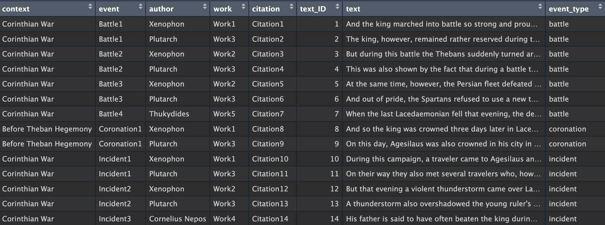

<div style="overflow: hidden;">


<h1>

R historical2 v1.1.1
</h1>

<p>

<em>by ATSzimmat</em>
</p>

</div>

Welcome to the package R historical2 - a new tool that wants to
facilitate work with primary sources of history in R!

To obtain information about the past, it is essential to examine the
evidence that has survived the testimonies of time and is still
available to us today. These evidences can appear in many forms – as
inscriptions on stones, as ancient ruins, or as texts that report on the
time, sometimes even as contemporary witnesses. These evidences (or
primary sources) are simply referred to as “sources” in historical
science, and any “history books” written about these sources are called
“(research) literature”. If historians want to answer a research
question, they first have the task of collecting the sources relevant to
their research and then evaluating them scientifically, taking into
account the existing literature. Afterwards, they usually want to
compile the sources into an organized text with the correct citations (a
so-called source paper) in order to present their sources. However, the
process of finding the sources, managing them, and ultimately creating
the source paper can easily become very tedious and time-consuming. The
author of this package is currently majoring in history and minoring in
statistics and data science at the LMU of Munich and has faced this
challenge several times himself.

## How R historical2 can simplify a historian’s daily work

When a historian gathers his sources, he is usually faced with an
overwhelming mountain of sources, spends time reading through them, and
then creates a selection of sources, which he then interprets,
criticizes, and evaluates. However, he encounters several problems.
Finding the right sources and even accessing a reliable text of the
sources and their translation can take ages, and efficiently managing
and narrowing down the masses of sources is a laborious process. R
historical2 is intended as a kind of source manager that aims to
alleviate these problems as much as possible and enable the historian to
quickly and efficiently build a dataframe from his sources, which can
then be further investigated using all the text analysis options R has
to offer. Appropriate analysis tools might be added to R historical2 in
the future to further accelerate the workflow.

## How R historical2 works

When you install R historical2, in addition to the functions, a dataset
called the_sources is added. This provides the text of all the source
excerpts available in the_sources along with corresponding metadata.



In the future, hopefully all existing sources will be stored there;
however, in this initial version, the dataset only contains a few
made-up source excerpts with placeholder metadata. Historians can use
the hist_sources() function to limit the_sources to a selection of
sources that meet certain conditions — e.g. only source excerpts from a
specific author or a specific event. If the_sources already contains all
the sources you need for your research question, this saves the
historian a considerable amount of work. Furthermore, the_sources
provides a standardized format for storing source excerpts, preventing
the uncontrolled creation of multiple source collections (each with its
own concept).

This source selection can be expanded with hist_include to include your
own sources that are not (yet) provided as part of the_sources. On the
other hand, this selection can also be restricted with two other R
historical2 functions. With hist_contain, you can limit the source
selection to sources that contain specific words, and with hist_delete,
you can remove unwanted source excerpts directly from your source
selection. Once you’ve quickly and efficiently created a selection of
sources in the form of a dataframe, you can use hist_text to convert
this dataframe into a selection of sources as structured full text.
Alternatively, you can use hist_sources to output the text of the
sources already when you gather your sources.

## The functions

### hist_sources

- filters the dataset the_sources according to the specified parameters.
- If output_text = TRUE, the result text is provided formatted as
  output, ready to be incorporated into a source paper document.
- If you choosse output_text = FALSE, don’t worry! You can use hist_text
  to output the text of your source selection later.
- Example

``` r
# All source excerpts from Xenophon on the Corinthian War as dataframe
Xenophon_Corinthian <- hist_sources(author = "Xenophon", context = "Corinthian War", output_text = FALSE)
# As source compilation
hist_sources(author = "Xenophon", context = "Corinthian War", output_text = TRUE)
```

### hist_include

- adds your own source excerpts with the corresponding metadata as a
  dataframe to the dataset the_sources.
- However, the columns of your dataset must match those of the_sources
  and must be in the same order and with the same variable types.
- Example

``` r
# Some example data
new_data <- data.frame(context = "Corinthian War", event = "NewBattle1", author = "Plutarch", work = "Work3", citation = "NewCitation6", text_ID = 15, text = "The fleets clashed near Cnidus.", event_type = "battle", stringsAsFactors = FALSE)
# Don't forget to load the_sources in your Global Environment before working with hist_include
the_sources <- the_sources
# Adjust the column data types to match those of the_sources
new_data$context <- as.factor(new_data$context)
new_data$event_type <- as.factor(new_data$event_type)
```

### hist_contain

- filters a source dataframe created with hist_sources (text_output set
  on FALSE) by the occurrence of source excerpts containing specific
  words.
- Use + to require multiple words in the same text (e.g. “king+battle”).
  Multiple arguments represent an OR condition. Case sensitivity is
  ignored.
- Example

``` r
# Example source dataframe created with hist_sources
Xenophon_Corinthian <- hist_sources(author="Xenophon",context="Corinthian War", output_text = FALSE)
# Only source excerpts containing "king+battle" or "Thebans"
hist_contain(Xenophon_Corinthian, "king+battle","Thebans")
```

### hist_delete

- deletes specific rows from a source dataframe created with
  hist_sources (text_output set on FALSE), identified by their text_ID
  values.
- Example

``` r
# Example source dataframe created with hist_sources
Xenophon_Corinthian <- hist_sources(author="Xenophon",context="Corinthian War", output_text = FALSE)
# Delete the source excerpts with IDs 5 and 14
hist_delete(Xenophon_Corinthian, ID = c(5, 14))
```

### hist_text

- converts a source dataframe that you created with hist_sources into a
  structured source compilation ready to be incorporated into a source
  paper document.
- Example

``` r
# Example source dataframe created with hist_sources
Xenophon_Corinthian <- hist_sources(author="Xenophon", context="Corinthian War", output_text = FALSE)
# Output the source-paper
hist_text(Xenophon_Corinthian)
```

## Installation

You can install the package via

``` r
remotes::install_github("ATSzimmat/Rhistorical2")
```
